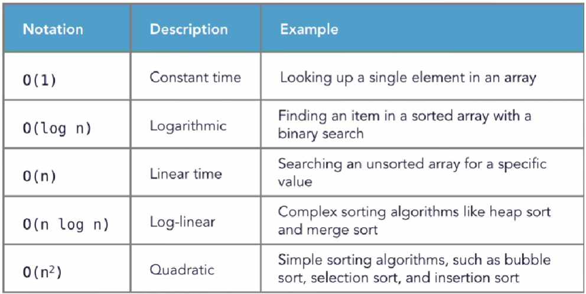

# Algorithms
#### 1. Brute Force (Linear Search, Selection Sort)
#### 2. Divide and Conquer (Merge Sort, Binary Search)
#### 3. Dynamic Programming (Up-bottom and and bottom-up)
#### 4. Greedy Algorithms (for optimization)
#### 5. Backtracking (Branch and Bound)
#### 6. Local Search
#### 7. Transform and Conquer
# Understanding Algorithm Performance
**Big-O Notation** is a way of expressing an upper bound on the execution time or space requirements of an algorithm.

- Measure how an algorithm responds to dataset size
- Big-O notation
  - Classifies performance as the input size grows
  - "O" indicates the order of operation: time scale to perform an operation
- Many algorithms and data structures have more than one Big O
  - Inserting data, searching for data, deleting data, etc.
## Common Big-O Terms


- O(n^3) - Cubic
- O(2^n) - Exponential
- O(n!) - Factorial

Basic operations include:
- Assignments
- Arithmetic operations
- Comparison statements
- Calling a function
- Return statements

One way to count the basic operation is:
```python
n = 100  # Assignment statement 1 time
count = 0  # Assignment statement 1 time
while count < n:  # Comparison statement n times
    count += 1  # Arithmetic operation (and assignment!) n times + n times
    print(count)  # Output statement n times
```
In total, that's 1+1+n+n+n+n =  4n + 2 basic operations.

How to determine which big-O class an algorithm belongs to?
- We make some drastic simplifications
- Depending on how we count, an algorithm may look to have 2n or 5n + 20 basic operations, but for the purposes of analyzing its time complexity, we would consider both to be equivalent to O(n)
- Throw away constants
  - If we have 2n basic operations, we simplify and say the algorithm is O(n)
  - If we have 200 basic operations, we simplify that to O(1)
- Ignore all but the largest term
  - n + 100 operations is simplified to O(n), and so is 500n + 100
  - if we have n^2 + 40n + 400 basic operations, we classify the time complexity as O(n^2)

## Examples of time complexity
### O(1) Complexity:
A simple statement:
```python
n = 100
```
The simple statement takes O(1) time.
### O(n) Complexity:
For Loop:
```python
for i in range(n):
    print(n)
```
The output statement occurs n times, so the loop is O(n).

While loop:
```python
count = 0
while count < n:
    count += 1
```
This while loop takes O(n) time. The smaller, constant time operation of assignment (count=0) is ignored.
```python
n = 100
for i in range(n, 0, -5):  # i ranges from n to 1 in steps of 5.
    print(i, end=', ')  # Output statement occurs n/5 times
```
Output:
```
100, 95, 90, 85, 80, 75, 70, 65, 60, 55, 50, 45, 40, 35, 30, 25, 20, 15, 10, 5,
```
If the for loop counter increases or decreases by a constant, the cost is O(n).
### O(log(n)) Complexity:
```python
n = 100
while n > 0:
    n = n // 2
    print(n) # Output statement occurs approximately log2(n) times.
```
Output:
``` 
50, 25, 12, 6, 3, 1, 0, 
```
If a loop counter increases or decreases by a multiple, the cost is O(log(n)).
### O(n^2) Complexity:
```python
for i in range(n):
    for j in range(n):
        print(i, j)
```
Here, the output statement occurs n*n times, so the loop is O(n^2).
## Space Complexity
```python
def my_sum(lst):
    total = 0
    for i in range(len(lst)):
        total += lst[i]
    return total

my_list = [5, 4, 3, 2, 1]
print(my_sum(my_list))
```
Output:
```
15
```
Well, aside from the input, we only have two variables used in the function, we have "total" and we have "i". Regardless of the contents of the list, we are always only going to have these same two variables, each of which contains a single number. While we add to the total variable, we don't create or add any new variables. Since we are discussing space, not time complexity, we are not interested in the number of operations. So the space complexity is O(1) here. 
```python
def double(lst):
    new_list = []
    for i in range(len(lst)):
        new_list.append(lst[i] * 2)
    return new_list


my_list = [5, 4, 3, 2, 1]
print(double(my_list))
```
Output:
```
[10, 8, 6, 4, 2]
```
The longer the list passed to the function is the longer the new list that gets returned is. This means that the function's required space will increase depending on the length of the input list. Hence the space requirement increases as the size of the input list increases. So the function has O(n) space complexity.
# Sorting Data
## The Bubble Sort
- Very simple to understand and implement
- Performance: O(n^2)
  - For loops inside of for loops are usually n^2
- Other sorting algorithms are generally much better
- Not considered to be a practical solution
## The Merge sort
- Divide-and-conquer algorithm
- Breaks a dataset into individual pieces and merges them
- Uses recursion to operate on datasets
- Performs well on large sets of data
- In general has a performance of O(n log n) time complexity
## The Quick sort
- Divide-and-conquer algorithm, like the merge sort
- Also uses recursion to perform sorting
- Generally performs better than merge sort, O(n log n)
- Operates in place on the data
- Worst case is O(n2) when data is mostly sorted already

