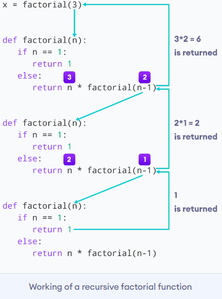

# Recursion
## What is recursion?
Recursion is the process of defining something in terms of itself.

A physical world example would be to place two parallel mirrors facing each other. Any object in between them would be reflected recursively.
## Python Recursive Function
In Python, we know that a function can call other functions. It is even possible for the function to call itself. These types of construct are termed as recursive functions.
### Example of a recursive function
```python
def factorial(x):
    """This is a recursive function
    to find the factorial of an integer"""

    if x == 1:
        return 1
    else:
        return x * factorial(x-1)


num = 3
print("The factorial of", num, "is", factorial(num))
```
### Output 
```
The factorial of 3 is 6
```
In the above example, factorial() is a recursive function as it calls itself.

When we call this function with a positive integer, it will recursively call itself by decreasing the number.

Each function multiplies the number with the factorial of the number below it until it is equal to one. This recursive call can be explained in the following steps.
```
factorial(3)          # 1st call with 3
3 * factorial(2)      # 2nd call with 2
3 * 2 * factorial(1)  # 3rd call with 1
3 * 2 * 1             # return from 3rd call as number=1
3 * 2                 # return from 2nd call
6                     # return from 1st call
```
Let's look at an image that shows a step-by-step process of what is going on:



Our recursion ends when the number reduces to 1. This is called the base condition.

Every recursive function must have a base condition that stops the recursion or else the function calls itself infinitely.

The Python interpreter limits the depths of recursion to help avoid infinite recursions, resulting in stack overflows.

By default, the maximum depth of recursion is 1000. If the limit is crossed, it results in RecursionError. Let's look at one such condition.
### Advantages of Recursion
1. Recursive functions make the code look clean and elegant.
2. A complex task can be broken down into simpler sub-problems using recursion.
3. Sequence generation is easier with recursion than using some nested iteration.
### Disadvantages of Recursion
1. Sometimes the logic behind recursion is hard to follow through.
2. Recursive calls are expensive (inefficient) as they take up a lot of memory and time.
3. Recursive functions are hard to debug.

Source: https://www.programiz.com/python-programming/recursion
